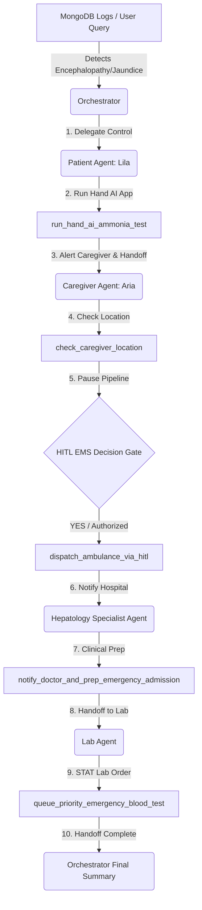

# LiverLink Multi-Agent Emergency Handoff Flow Reference

This document summarizes the complete step-by-step sequential workflow of the multi-agent emergency escalation pipeline. You can use this for reference, recordings, or demonstration purposes.

---

## Complete Multi-Agent Workflow



### Step 1: Initial Emergency Trigger (Orchestrator Interception)
- **Action:** A severe symptom warning (jaundice or severe fatigue/nausea) is flagged in the patient's MongoDB logs.
- **Orchestrator Interception:** The Global Care Coordinator intercepts the critical parameters and initiates the escalation flow.
- **Trigger Query:**
  > *"John's MongoDB logs have flagged an urgent jaundice & encephalopathy risk alert! Can you coordinate with Aria (caregiver) and recommend clinical steps for Dr. Elizabeth Vance?"*
- **Response:** The Orchestrator delegates control to Lila (`patient_agent_agent`).

---

### Step 2: Patient Agent Check-In & Hand AI Tremor Scan (`Lila`)
- **Lila Greeting Banner:**
  > **LIVERLINK URGENT CHECK-IN**
  >
  > John, our system has flagged a critical symptom alert from your profile.
  > We need to run the Hand AI Ammonia check-in right now to check for motor tremors and asterixis. Please check your phone for a notification.
  >
  > If you are unresponsive or unable to complete this, your caregiver has been immediately alerted to assist you in completing the test and starting the regular emergency flow.
- **Command:** `run the Hand AI test`
- **Executed Tool:** `run_hand_ai_ammonia_test()`
  - Saves a clinical assessment record to `health_checker.MobileRes` (Grade 1 Encephalopathy detected).
  - Automatically dispatches a Telegram notification alert to the patient's device.
- **Handoff:** Control is immediately transferred to `caregiver_agent`.

---

### Step 3: Caregiver Action & HITL EMS Dispatch (`Aria`)
- **Aria Greeting Banner:**
  > **CRITICAL EMERGENCY BRIEFING**
  >
  > I'm **Aria**, the LiverLink caregiver companion. John's system has logged an urgent symptom warning! If John is unresponsive or unable to complete the test, please check on him immediately, assist him with the Hand AI Ammonia check-in, and we will initiate our emergency care orchestration flow immediately.
- **Command:** `Please check caregiver location and escalate`
- **Executed Tool:** `check_caregiver_location()`
  - Detects that the caregiver is **FAR** (15.4km away).
- **Human-In-The-Loop Decision Gate:**
  Aria pauses automation execution and asks for explicit approval in chat:
  > **HUMAN-IN-THE-LOOP EMS DECISION GATE**
  > ↳ **Aria**: Caregiver is **FAR** (15.4km away). John's Hand AI test has confirmed grade 1-2 hepatic encephalopathy.
  >
  > Do you authorize LiverLink to dispatch an emergency ambulance to John's residence immediately? (Please reply **YES** or **NO**)
- **Command:** `YES`
- **Executed Tool:** `dispatch_ambulance_via_hitl(authorized=True)`
- **Handoff:** Control transferred to `hepatology_specialist_agent`.

---

### Step 4: Clinical Admission Prep (`Hepatology Specialist`)
- **Executed Tool:** `notify_doctor_and_prep_emergency_admission("patient_john_doe")`
  - Preps the emergency admission terminal at Akeso Hospital.
  - Formally notifies Dr. Elizabeth Vance regarding the critical symptoms.
- **Handoff:** Control transferred to `lab_agent`.

---

### Step 5: STAT Lab Queue Order (`Lab Agent`)
- **Executed Tool:** `queue_priority_emergency_blood_test("patient_john_doe")`
  - Instantly queues a STAT emergency blood test order (LFT and Ammonia Panel) for when the patient arrives.
- **Handoff:** Control handed back to `liverlink_orchestrator`.

---

### Step 6: Final Compilation Summary (Orchestrator)
- The Orchestrator delivers the finalized step-by-step handoff report (all voice-disruption elements like `🚨` emojis have been removed):

```markdown
**LIVERLINK EMERGENCY PIPELINE COMPLETED**
──────────────────────────────────────────────────
* 📱 **Hand AI Ammonia App**: Tremor check completed & saved to DB.
* 🚑 **EMS Ambulance**: Caregiver authorized dispatch → Ambulance arrived.
* 🩺 **Akeso Clinical Prep**: Record prepped for Dr. Elizabeth Vance.
* 🧪 **Emergency Lab Queue**: STAT lab order (Ammonia + LFT) queued.

👉 **[Go to Doctor Portal to Review Patient Summary](javascript:openDashboard('doctor'))**
👉 **[Go to Lab Portal to Process STAT Sample](javascript:openDashboard('lab'))**
```
